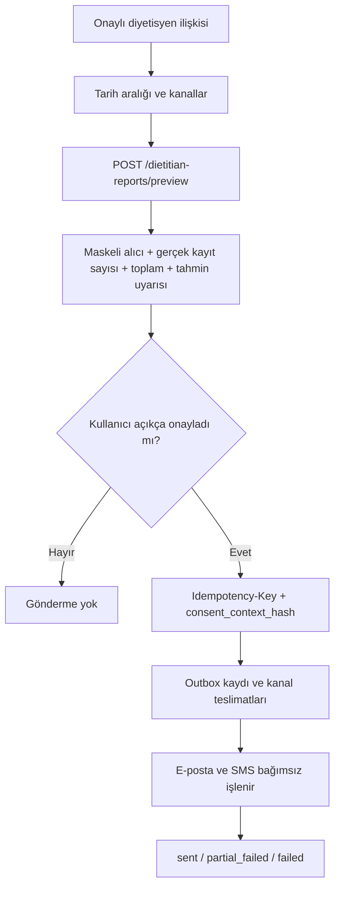

# Diyetisyen raporu teslimatı

**Durum:** Uygulandı ve sentetik sandbox verisiyle doğrulandı  
**Son doğrulama:** 18 Temmuz 2026  
**Kapsam:** Kullanıcının seçtiği ve onayladığı gerçek geçmiş kayıtlarının, doğrulanmış bir diyetisyene e-posta ve/veya güvenli SMS özeti olarak gönderilmesi

Bu özellik tıbbi tavsiye üretmez. Gönderim, yalnızca kullanıcının onayladığı beslenme günlüğünü paylaşır. Otomatik/periyodik paylaşım yoktur.

## Ön koşullar ve güven sınırı

Gönderim ancak aşağıdaki koşullar birlikte sağlanırsa başlar:

1. İstek yapan kullanıcı geçerli access token ile doğrulanmıştır.
2. Kullanıcının kendisine ait, `approved` durumunda bir diyetisyen ataması vardır.
3. Seçilen her kanal için diyetisyen iletişim bilgisi backend'de doğrulanmıştır.
4. Tarih aralığında en az bir `confirmed` besin kaydı vardır.
5. Mobil uygulama backend'den önizleme almıştır.
6. Kullanıcı alıcıyı, kanalları, tarih aralığını ve kayıt sayısını içeren erişilebilir özeti dinlemiş/görmüştür.
7. Kullanıcı bu gönderim için ayrı açık onay vermiştir.
8. Gönderim isteği, önizlemenin `consent_context_hash` değeri ve en az 16 karakterlik `Idempotency-Key` taşır.

Hesap UUID'si ve araştırma katılımcısı pseudonym'i birleştirilmez. Bu özellik yalnızca ürün hesabına ait, sahiplik kontrolü yapılmış gerçek geçmişi kullanır. Kullanıcı her gönderimde adres yazmaz; doğrulanmış atamadaki iletişim bilgileri maskeli gösterilir. İleride manuel alıcı girişi eklenirse doğrulama ve yeniden açık onay olmadan kullanılamaz.

## Kullanıcı akışı



Mobil wizard dört aşamalıdır: seçim, sunucu önizlemesi, açık onay ve kanal bazlı sonuç. Önizleme özeti tek bir anlamlı ekran okuyucu cümlesidir. Gönder düğmesi işlem sürerken devre dışıdır. Aynı önizleme için üretilen idempotency anahtarı sonuç alınana kadar değişmez.

## Önizleme ve rıza kanıtı

`POST /api/v1/dietitian-reports/preview` sağlayıcı çağırmaz ve veritabanında gönderim oluşturmaz. Backend:

- tarih aralığını en fazla 31 günle sınırlar;
- gelecekteki tarihi reddeder;
- yalnızca güncel kullanıcıya ait, silinmemiş ve `confirmed` kayıtları seçer;
- doğrulanmamış kanalı reddeder;
- alıcıları e-posta/telefon için maskeler;
- gönderilecek tam kayıt kümesi, alıcı snapshot'ı, dönem, kanallar ve kullanıcı notundan SHA-256 bağlam özeti üretir.

Gönderim sırasında bu bağlam yeniden hesaplanır. Kayıt, alıcı, kanal, tarih veya not değişmişse eski önizleme ile gönderim `409` döner. Kullanıcının yeni önizleme görmesi gerekir. Rıza kaydında bağlam özeti, maskeli alıcı, dönem, kanal listesi, kayıt sayısı ve request id saklanır; açık iletişim bilgisi rıza audit metadatasına yazılmaz.

## Minimum veri içeriği

### E-posta

E-posta yalnızca kullanıcı tarafından onaylanmış kayıtları içerir:

- dönem ve kayıt sayısı;
- toplam ve günlük ortalama kalori;
- Türkçe besin adı, onaylı/tahmini porsiyon, kalori, zaman ve tanıma kaynağı;
- kaynak açıklaması ve tahmini porsiyon sayısı;
- kullanıcının isteğe bağlı notu;
- “tıbbi tavsiye değildir” uyarısı.

Mesaj `multipart/alternative` olarak hem UTF-8 plain text hem HTML üretir. HTML tablo başlığı ve sütun başlıkları içerir. Bu aşamada PDF ek üretilmez. Gelecekte PDF gerekiyorsa etiketli okuma sırası, dil metadatası, gerçek metin katmanı, tablo başlık ilişkileri, renk dışı anlam ve ekran okuyucu doğrulaması ayrıca kabul kapısıdır.

### SMS

SMS tam beslenme günlüğünü, besin adlarını, kalori/makro değerlerini veya sağlık ayrıntısını içermez. Yalnızca dönem, onaylı kayıt sayısı, ayrıntıların SMS'e konmadığı bilgisi ve tıbbi tavsiye uyarısı vardır. Süreli güvenli bağlantı henüz uygulanmadığı için SMS'te bağlantı da gönderilmez. İleride bağlantı eklenirse kısa ömürlü, tek kullanımlık, alıcıya bağlı ve revoke edilebilir olmalıdır; URL loglara veya analitik araçlara sızmamalıdır.

## Outbox, idempotency ve durumlar

HTTP 200, kişinin mesajı teslim aldığı anlamına gelmez. Yalnızca işlem sonucunun kaydedildiğini bildirir. `sent`, mevcut entegrasyonda sağlayıcının mesajı kabul ettiği anlamındadır.

| Seviye | Durum | Anlam |
|---|---|---|
| Rapor | `queued` | Transaction içinde rapor ve kanal işleri oluşturuldu. |
| Rapor | `sending` | En az bir kanal sağlayıcıya gönderiliyor. |
| Rapor | `sent` | Seçilen tüm kanallar sağlayıcı tarafından kabul edildi. |
| Rapor | `partial_failed` | En az bir kanal kabul edildi, en az biri başarısız. |
| Rapor | `failed` | Hiçbir seçili kanal kabul edilmedi. |
| Kanal | `queued` | Henüz denenmedi. |
| Kanal | `sending` | Sağlayıcı çağrısından önce kalıcılaştırıldı. |
| Kanal | `sent` | Provider message id/status saklandı. |
| Kanal | `failed` | Redakte edilmiş hata kodu, deneme sayısı ve sonraki deneme zamanı saklandı. |

Aynı kullanıcı ve aynı `Idempotency-Key` tekrar gönderilirse yeni rapor/mesaj oluşturulmaz; önceki sonuç `duplicate=true` ile döner. Aynı anahtar farklı bir önizleme bağlamıyla kullanılırsa `409` döner.

Retry yalnız başarısız ve yeniden denenebilir kanala uygulanır. Geri çekilme `60 * 2^(attempt-1)` saniyedir ve kanal başına en fazla üç deneme vardır. E-posta başarılı, SMS başarısız olduğunda rapor `partial_failed` kalır ve mobil kullanıcıya iki kanal ayrı gösterilir.

SMTP/Twilio gibi dış sistemlerde atomik “tam olarak bir kez” garantisi yoktur. Sağlayıcı mesajı kabul ettikten fakat DB commitinden önce süreç çökerse kanal `sending` kalabilir. Otomatik tekrar çift gönderim riski yaratacağı için `sending` işler körlemesine retry edilmez; production'da provider sorgulama/webhook ile reconciliation işi kurulmalıdır.

## Sahiplik, audit ve geçmiş

- Başka kullanıcının raporunu listeleme veya retry etme girişimi kaynak varlığını sızdırmamak için `404` döner.
- Yetkisiz istek `401` döner.
- `dietitian_report_consent_granted` olayı açık onay ve bağlamı kaydeder.
- `dietitian_report_delivery_processed` olayı rapor ve kanal sonucunu kaydeder.
- Audit metadatasında secret, açık telefon/e-posta veya mesaj gövdesi yoktur.
- Kullanıcı `GET /api/v1/dietitian-reports` ile kendi gönderim geçmişini ve kanal durumlarını görür.

Rapor payload snapshot'ı yeniden denemelerde aynı içeriğin korunmasını sağlar. Production'a geçmeden önce rapor, teslimat ve audit kayıtlarının saklama/silme süreleri kurumun KVKK politikasıyla belirlenmeli; hesap silme, yedek silme ve sağlayıcı retention süreçleri birlikte test edilmelidir.

## Secret ve sandbox yapılandırması

SMTP/Twilio değerleri yalnız backend environment veya secret store'dan okunur. Mobil binary'de bulunmaz. `.env.example` yalnız değişken adları/açıklamaları ve sentetik RFC-reserved örnek alıcıları içerir.

Temel anahtarlar:

- `NOTIFICATION_MODE=disabled|sandbox|production`
- `NOTIFICATION_SANDBOX_EMAIL_ALLOWLIST`
- `NOTIFICATION_SANDBOX_PHONE_ALLOWLIST`
- `SMTP_HOST`, `SMTP_PORT`, `SMTP_USER`, `SMTP_PASSWORD`
- `SMTP_USE_TLS`, `SMTP_START_TLS`, `SMTP_FROM_EMAIL`, `SMTP_FROM_NAME`
- `TWILIO_ACCOUNT_SID`, `TWILIO_AUTH_TOKEN`, `TWILIO_PHONE_NUMBER`

Sandbox modu allowlist dışındaki alıcıyı sağlayıcı çağrısından önce reddeder. Yerel Mailpit için SMTP user/password boş, TLS ve STARTTLS kapalı olmalıdır. Production `.env` değeri sandbox testine devralınmamalıdır. Secret değerleri terminale, teste, audit kaydına veya rapora yazdırılmaz. Bir secret daha önce Git'e girdiyse yalnız dosyadan silmek yeterli değildir; sağlayıcı panelinden rotasyon yapılmalıdır.

## Tekrar üretilebilir Mailpit kanıtı

Aşağıdaki komut yalnız localhost'ta geçici Mailpit açar ve RFC tarafından gerçek kullanım için ayrılmış `example.invalid` alıcısına sentetik fixture gönderir:

```powershell
cd C:\Users\TAHA\Desktop\2209\nutrisense
docker run --rm -d --name nutrisense-mailpit-evidence `
  -p 127.0.0.1:8025:8025 -p 127.0.0.1:1025:1025 axllent/mailpit:v1.21

cd backend
$env:MAILPIT_E2E = "1"
.\venv\Scripts\python.exe -m pytest tests\test_mailpit_sandbox_e2e.py -q
Remove-Item Env:MAILPIT_E2E

docker stop nutrisense-mailpit-evidence
```

18 Temmuz 2026 doğrulaması:

- Mailpit mesaj sayısı: `1`;
- provider status: `accepted` ve Message-ID mevcut;
- plain-text gövde: mevcut;
- HTML gövde ve semantik tablo: mevcut;
- tıbbi tavsiye uyarısı: mevcut;
- ek dosya: `0`;
- gerçek alıcı/gerçek sağlık verisi: kullanılmadı.

Twilio yolu otomatik testlerde enjekte edilen mock transport ile doğrulanır. Mesaj içeriği ve provider SID/status eşlemesi test edilir; canlı/test credential bu repoda bulunmaz. Twilio sandbox/test credential çalıştırması, kurum hesabı ve onaylı sentetik allowlist sağlanmadan production kabul kanıtı sayılmaz.

## Test kapsamı ve komutlar

```powershell
cd C:\Users\TAHA\Desktop\2209\nutrisense\backend
.\venv\Scripts\python.exe -m pytest tests\test_dietitian_report_delivery.py -q
.\venv\Scripts\python.exe -m pytest -q
.\venv\Scripts\python.exe scripts\export_openapi.py --check

cd C:\Users\TAHA\Desktop\2209\nutrisense
flutter test test\widget\dietitian_report_wizard_test.dart `
  test\contract\api_contract_test.dart
flutter analyze --no-fatal-infos
```

Testler no dietitian, doğrulanmamış kanal, açık rıza yokluğu, boş dönem, kısmi hata, backoff/retry, duplicate request, IDOR, yetkisiz erişim, audit kaydı, multipart e-posta, minimum-verili SMS ve mobil erişilebilir onay kapısını kapsar.

## Production runbook ve kabul kapıları

1. Migration yedekli staging DB'de up/down ve veri doluyken doğrulanır.
2. `NOTIFICATION_MODE=production`; secret'lar yalnız secret manager üzerinden verilir.
3. SMTP gönderen domain için SPF, DKIM ve DMARC; Twilio için onaylı gönderici ve ülke kuralları tamamlanır.
4. Diyetisyen kimliği ve iletişim doğrulamasının kurumsal sahibi belirlenir.
5. Provider webhook imzası doğrulanır; delivery/bounce/undelivered durumları kanal kaydına eşlenir.
6. `sending` reconciliation, dead-letter alarmı, maksimum retry ve operasyon dashboard'u kurulur.
7. Log redaksiyonu ve secret taraması staging'de doğrulanır.
8. Sandbox allowlist testi geçmeden production alıcısına izin verilmez.
9. Gerçek cihazda TalkBack/VoiceOver ile önizleme, açık onay, kısmi hata ve retry akışı tamamlanır.
10. KVKK/etik/hukuk kabul kapıları yazılı olarak kapanmadan gerçek beslenme verisi gönderilmez.

Kalan hukuki/kurumsal kararlar: veri işleme hukuki sebebi ve açık rıza metni, diyetisyenin rolü/veri sorumluluğu, yurt dışına aktarım ve sağlayıcı sözleşmeleri, saklama-imha süresi, rıza geri çekme etkisi, veri sahibi başvurusu, ihlal bildirimi ve araştırma/ürün verisi sınırı. Bu teknik uygulama hukuki onay yerine geçmez.
