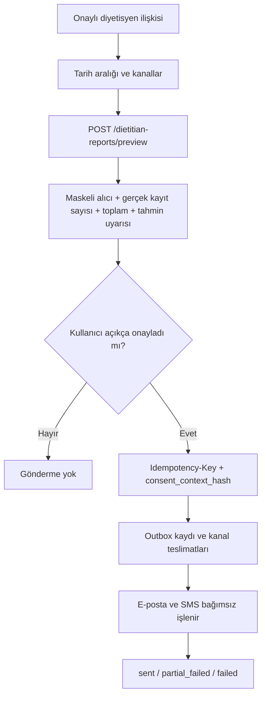

# Diyetisyen raporu teslimatı

**Durum:** Uygulandı ve sentetik sandbox verisiyle doğrulandı  
**Son içerik/yeniden deneme doğrulaması:** 7 Eylül 2026 (sentetik otomatik testler)

**Kapsam:** Kullanıcının seçtiği ve onayladığı geçmiş kayıtlarının besin adı, gram miktarı, tarih-saat ve kalori bilgileriyle doğrulanmış diyetisyene e-posta ve/veya SMS üzerinden gönderilmesi

Bu özellik tıbbi tavsiye üretmez. Gönderim, yalnızca kullanıcının onayladığı beslenme günlüğünü paylaşır. Otomatik/periyodik paylaşım yoktur.

## Ön koşullar ve güven sınırı

Gönderim ancak aşağıdaki koşullar birlikte sağlanırsa başlar:

1. İstek yapan kullanıcı geçerli access token ile doğrulanmıştır.
2. Kullanıcının kendisine ait, `approved` durumunda bir diyetisyen ataması vardır.
3. Seçilen her kanal için diyetisyen iletişim bilgisi backend'de doğrulanmıştır.
4. Tarih aralığında en az bir `confirmed` besin kaydı vardır.
5. Mobil uygulama backend'den önizleme almıştır.
6. Kullanıcı alıcıyı, kanalları, tarih aralığını ve kayıt sayısını içeren erişilebilir özeti dinlemiş/görmüştür.
7. Kullanıcı bu gönderim için ayrı açık onay vermiştir.
8. Gönderim isteği, önizlemenin `consent_context_hash` değeri ve en az 16 karakterlik `Idempotency-Key` taşır.

Hesap UUID'si ve araştırma katılımcısı pseudonym'i birleştirilmez. Bu özellik yalnızca ürün hesabına ait, sahiplik kontrolü yapılmış gerçek geçmişi kullanır. Kullanıcı her gönderimde adres yazmaz; doğrulanmış atamadaki iletişim bilgileri maskeli gösterilir. İleride manuel alıcı girişi eklenirse doğrulama ve yeniden açık onay olmadan kullanılamaz.

## Kullanıcı akışı



Mobil wizard dört aşamalıdır: seçim, sunucu önizlemesi, açık onay ve kanal bazlı sonuç. Önizleme özeti tek bir anlamlı ekran okuyucu cümlesidir. Gönder düğmesi işlem sürerken devre dışıdır. Aynı önizleme için üretilen idempotency anahtarı sonuç alınana kadar değişmez.

## Önizleme ve rıza kanıtı

`POST /api/v1/dietitian-reports/preview` sağlayıcı çağırmaz ve veritabanında gönderim oluşturmaz. Backend:

- tarih aralığını en fazla 31 günle sınırlar;
- gelecekteki tarihi reddeder;
- yalnızca güncel kullanıcıya ait, silinmemiş ve `confirmed` kayıtları seçer;
- doğrulanmamış kanalı reddeder;
- alıcıları e-posta/telefon için maskeler;
- gönderilecek tam kayıt kümesi, alıcı snapshot'ı, dönem, kanallar ve kullanıcı notundan SHA-256 bağlam özeti üretir.

Gönderim sırasında bu bağlam yeniden hesaplanır. Kayıt, alıcı, kanal, tarih veya not değişmişse eski önizleme ile gönderim `409` döner. Kullanıcının yeni önizleme görmesi gerekir. Rıza kaydında bağlam özeti, maskeli alıcı, dönem, kanal listesi, kayıt sayısı ve request id saklanır; açık iletişim bilgisi rıza audit metadatasına yazılmaz.

## Minimum veri içeriği

### E-posta

E-posta yalnızca kullanıcı tarafından onaylanmış kayıtları içerir:

- dönem ve kayıt sayısı;
- toplam ve günlük ortalama kalori;
- Türkçe besin adı, onaylı/tahmini porsiyon, kalori, zaman ve tanıma kaynağı;
- kaynak açıklaması ve tahmini porsiyon sayısı;
- kullanıcının isteğe bağlı notu;
- “tıbbi tavsiye değildir” uyarısı.

Mesaj `multipart/alternative` olarak hem UTF-8 plain text hem HTML üretir. HTML tablo başlığı ve sütun başlıkları içerir. Bu aşamada PDF ek üretilmez. Gelecekte PDF gerekiyorsa etiketli okuma sırası, dil metadatası, gerçek metin katmanı, tablo başlık ilişkileri, renk dışı anlam ve ekran okuyucu doğrulaması ayrıca kabul kapısıdır.

### SMS

Yeni `dietitian-report-v3` raporlarında SMS her onaylı kayıt için Türkçe besin
adı, gram miktarı (tahminse işaretli), kalori ve saat dilimi içeren kayıt
tarih-saatini taşır. Örneğin:

```text
1. Elma; 150.5 g (tahmini); 78.25 kcal; 2026-09-07T12:30:00+03:00
```

Kullanıcı adı, telefon, görüntü, makrolar ve serbest not SMS gövdesine eklenmez.
E-posta HTML ve düz metin sürümleri aynı dört temel alanı taşır; gram ve kalori
küsuratları gereksiz yere tam sayıya yuvarlanmaz.

Uzun içerik kayıp olmadan `NutriSense (1/N)` biçiminde numaralandırılmış
mesajlara bölünür. Gövde başlık dahil en fazla 600 UTF-16 birimidir; Türkçe
karakterler ve emojiler korunur. Bu, operatörün ücretlendirdiği SMS segment
sayısıyla aynı değildir. [Twilio mesaj sınırları](https://www.twilio.com/docs/messaging/api/message-resource)
gereği sağlayıcı her gövdeyi ayrıca segmentlere ayırabilir.

Sunucu önizleme özeti mesaj sayısını ve SMS'te paylaşılacak alanları söyler.
Mobil seçim ve açık onay metinleri ayrıntılı paylaşımı açıklar. Rıza sürümü
`report-share-v3` oldu; eski önizleme özetiyle yeni içerik gönderilemez.
Kaydedilmiş v2 raporlarının yeniden denemesi yalnız eski kısa özeti gönderir;
önceki onayın kapsamı genişletilmez.

### Çok parçalı SMS ve yeniden deneme

Her parça için `queued/sending/sent/failed`, sağlayıcı mesaj kimliği ve durum
raporun `_sms_delivery` alanında kalıcılaştırılır. Bu alan teslimat durumudur;
onaylanan `records` içeriğine eklenmez ve rıza hash'ine girmez. Parça metinleri
ayrıca hash ile bağlanır; içerik değişmişse eski ilerleme kullanılamaz.

Gönderimden önce `sending`, sağlayıcı kabulünden sonra `sent` veritabanına
yazılır. Retry yalnız kabul edilmemiş parçalardan devam eder; e-posta veya
başarılı SMS parçaları tekrar gönderilmez. Kısmen kabul edilmiş SMS, tek kanal
seçilse bile `partial_failed` olarak gösterilir; `sent_via_sms` ancak bütün
parçalar kabul edilince true olur. Birden çok mesajın bütün kimlikleri
`_sms_delivery.parts` içinde, son kimlik mevcut kanal alanında tutulur.

Timeout/çökme sonrası kabul belirsizse `SMS_DELIVERY_UNCERTAIN` döner; sağlayıcı
uzlaştırması olmadan aynı parça tekrar gönderilmez. Bu düzen tam olarak bir
kez teslim garantisi veya gerçek telefonda okunma kanıtı değildir. Şema göçü
gerekmez; mevcut rapor JSON alanı kullanılır.

## Outbox, idempotency ve durumlar

HTTP 200, kişinin mesajı teslim aldığı anlamına gelmez. Yalnızca işlem sonucunun kaydedildiğini bildirir. `sent`, mevcut entegrasyonda sağlayıcının mesajı kabul ettiği anlamındadır.

| Seviye | Durum | Anlam |
|---|---|---|
| Rapor | `queued` | Transaction içinde rapor ve kanal işleri oluşturuldu. |
| Rapor | `sending` | En az bir kanal sağlayıcıya gönderiliyor. |
| Rapor | `sent` | Seçilen tüm kanallar sağlayıcı tarafından kabul edildi. |
| Rapor | `partial_failed` | En az bir kanal kabul edildi, en az biri başarısız. |
| Rapor | `failed` | Hiçbir seçili kanal kabul edilmedi. |
| Kanal | `queued` | Henüz denenmedi. |
| Kanal | `sending` | Sağlayıcı çağrısından önce kalıcılaştırıldı. |
| Kanal | `sent` | Provider message id/status saklandı. |
| Kanal | `failed` | Redakte edilmiş hata kodu, deneme sayısı ve sonraki deneme zamanı saklandı. |

Aynı kullanıcı ve aynı `Idempotency-Key` tekrar gönderilirse yeni rapor/mesaj oluşturulmaz; önceki sonuç `duplicate=true` ile döner. Aynı anahtar farklı bir önizleme bağlamıyla kullanılırsa `409` döner.

Retry yalnız başarısız ve yeniden denenebilir kanala uygulanır. Geri çekilme `60 * 2^(attempt-1)` saniyedir ve kanal başına en fazla üç deneme vardır. E-posta başarılı, SMS başarısız olduğunda rapor `partial_failed` kalır ve mobil kullanıcıya iki kanal ayrı gösterilir.

SMTP/Twilio gibi dış sistemlerde atomik “tam olarak bir kez” garantisi yoktur. Sağlayıcı mesajı kabul ettikten fakat DB commitinden önce süreç çökerse kanal `sending` kalabilir. Otomatik tekrar çift gönderim riski yaratacağı için `sending` işler körlemesine retry edilmez; production'da provider sorgulama/webhook ile reconciliation işi kurulmalıdır.

## Sahiplik, audit ve geçmiş

- Başka kullanıcının raporunu listeleme veya retry etme girişimi kaynak varlığını sızdırmamak için `404` döner.
- Yetkisiz istek `401` döner.
- `dietitian_report_consent_granted` olayı açık onay ve bağlamı kaydeder.
- `dietitian_report_delivery_processed` olayı rapor ve kanal sonucunu kaydeder.
- Audit metadatasında secret, açık telefon/e-posta veya mesaj gövdesi yoktur.
- Kullanıcı `GET /api/v1/dietitian-reports` ile kendi gönderim geçmişini ve kanal durumlarını görür.

Rapor payload snapshot'ı yeniden denemelerde aynı içeriğin korunmasını sağlar. Production'a geçmeden önce rapor, teslimat ve audit kayıtlarının saklama/silme süreleri kurumun KVKK politikasıyla belirlenmeli; hesap silme, yedek silme ve sağlayıcı retention süreçleri birlikte test edilmelidir.

## Onay sonrası otomatik yerel paylaşım

Diyetisyen panelindeki **Onay sonrası otomatik paylaşım** anahtarı başlangıçta
kapalıdır. Kullanıcının açıklamayı onaylaması `PUT /api/v1/dietitian-auto-share`
üzerinden ayrı bir `automatic_food_share_local` izin kaydı oluşturur. GET aynı
uçtan etkin durumu döndürür. İki alıcı kanalının da doğrulanmış olması gerekir.

Yeni tarama onayı, düzelterek onaylama ve onaylı manuel giriş, yalnız yeni besin
kaydını içeren e-posta ve SMS raporunu aynı veritabanı işlemi içinde kuyruğa
alır. Besin kaydı kimliği gönderimin tekrarını engeller. Önceki kayıtlar,
reddedilen analizler ve sonradan geçmiş düzenlemeleri otomatik gönderilmez.
Teslimat hatası kaydedilmiş besini geri almaz; durum rapor geçmişinde görünür.

Bu izin **yalnız yerel test içindir**: dev/test ortamı, sandbox bildirim modu,
yerel SMTP ve `local_outbox` birlikte gereklidir. Compose SMS sağlayıcısını
`local_outbox` olarak sabitler. Mailpit e-postaları localhost:8025'te, SMS
mesajları backend içindeki `/tmp/sms_outbox.jsonl` dosyasında görülür. Gerçek
adrese veya telefona gönderim yapılmaz. Ortam harici sağlayıcıya çevrilirse
otomatik gönderim ve bu raporların yeniden denenmesi engellenir; bu izin
gerçek gönderim iznine dönüşmez. İzin kapatılması, diyetisyen ilişkisinin
kaldırılması veya alıcı değişmesi eski izinle yeni teslimatı engeller.

Zamanlayıcı yoktur; tetikleyici yeni besin onayıdır. Doğrulama:
`backend/tests/test_automatic_food_share.py` ve
`test/widget/automatic_food_share_test.dart`.

## Secret ve sandbox yapılandırması

SMTP/Twilio değerleri yalnız backend environment veya secret store'dan okunur. Mobil binary'de bulunmaz. `.env.example` yalnız değişken adları/açıklamaları ve sentetik RFC-reserved örnek alıcıları içerir.

Temel anahtarlar:

- `NOTIFICATION_MODE=disabled|sandbox|production`
- `NOTIFICATION_SANDBOX_EMAIL_ALLOWLIST`
- `NOTIFICATION_SANDBOX_PHONE_ALLOWLIST`
- `SMTP_HOST`, `SMTP_PORT`, `SMTP_USER`, `SMTP_PASSWORD`
- `SMTP_USE_TLS`, `SMTP_START_TLS`, `SMTP_FROM_EMAIL`, `SMTP_FROM_NAME`
- `TWILIO_ACCOUNT_SID`, `TWILIO_AUTH_TOKEN`, `TWILIO_PHONE_NUMBER`

Sandbox modu allowlist dışındaki alıcıyı sağlayıcı çağrısından önce reddeder. Yerel Mailpit için SMTP user/password boş, TLS ve STARTTLS kapalı olmalıdır. Production `.env` değeri sandbox testine devralınmamalıdır. Secret değerleri terminale, teste, audit kaydına veya rapora yazdırılmaz. Bir secret daha önce Git'e girdiyse yalnız dosyadan silmek yeterli değildir; sağlayıcı panelinden rotasyon yapılmalıdır.

Yerel/dev/test ortamında `SMTP_HOST=mailpit|localhost|127.0.0.1` olduğunda
Mailpit dış dünyaya teslimat yapamayacağı için uygulamadaki doğrulanmış alıcı
adresleri ayrıca sandbox allowlist'e eklenmek zorunda değildir; alıcı başlığı
yakalanan mesajda inceleme amacıyla korunur. Aynı kural yalnız
`SMS_PROVIDER_MODE=local_outbox` için geçerlidir. Harici SMTP/Twilio sandbox
sağlayıcılarında allowlist zorunluluğu devam eder. Yeniden denenemez bir hata
kanalın deneme hakkını tüketir ve mobil arayüz yanıltıcı yeniden deneme düğmesi
göstermez.

## Tekrar üretilebilir Mailpit kanıtı

Aşağıdaki komut yalnız localhost'ta geçici Mailpit açar ve RFC tarafından gerçek kullanım için ayrılmış `example.invalid` alıcısına sentetik fixture gönderir:

```powershell
cd C:\Users\TAHA\Desktop\2209\nutrisense
docker run --rm -d --name nutrisense-mailpit-evidence `
  -p 127.0.0.1:8025:8025 -p 127.0.0.1:1025:1025 axllent/mailpit:v1.21

cd backend
$env:MAILPIT_E2E = "1"
.\venv\Scripts\python.exe -m pytest tests\test_mailpit_sandbox_e2e.py -q
Remove-Item Env:MAILPIT_E2E

docker stop nutrisense-mailpit-evidence
```

18 Temmuz 2026 doğrulaması:

- Mailpit mesaj sayısı: `1`;
- provider status: `accepted` ve Message-ID mevcut;
- plain-text gövde: mevcut;
- HTML gövde ve semantik tablo: mevcut;
- tıbbi tavsiye uyarısı: mevcut;
- ek dosya: `0`;
- gerçek alıcı/gerçek sağlık verisi: kullanılmadı.

Twilio yolu otomatik testlerde enjekte edilen mock transport ile doğrulanır. Mesaj içeriği ve provider SID/status eşlemesi test edilir; canlı/test credential bu repoda bulunmaz. Twilio sandbox/test credential çalıştırması, kurum hesabı ve onaylı sentetik allowlist sağlanmadan production kabul kanıtı sayılmaz.

## Test kapsamı ve komutlar

```powershell
cd C:\Users\TAHA\Desktop\2209\nutrisense\backend
.\venv\Scripts\python.exe -m pytest tests\test_dietitian_report_delivery.py -q
.\venv\Scripts\python.exe -m pytest -q
.\venv\Scripts\python.exe scripts\export_openapi.py --check

cd C:\Users\TAHA\Desktop\2209\nutrisense
flutter test test\widget\dietitian_report_wizard_test.dart `
  test\contract\api_contract_test.dart
flutter analyze --no-fatal-infos
```

Testler no dietitian, doğrulanmamış kanal, açık rıza yokluğu, boş dönem, kısmi hata, backoff/retry, duplicate request, IDOR, yetkisiz erişim, audit kaydı, multipart e-posta, ayrıntılı SMS ve mobil erişilebilir onay kapısını kapsar.

`test_detailed_sms.py` uzun Unicode mesajın kayıpsız bölünmesini, eski rızanın
korunmasını ve belirsiz kabulün yeniden gönderilmemesini doğrular.
`test_dietitian_report_delivery.py` gerçek NotificationService ile e-postayı
yakalar ve SMS'i geçici yerel kutuya yazar: ikinci parça başarısız olduktan
sonra servis yeniden oluşturulur, ilerleme DB'den alınır ve kalan parçalar
yinelenmeden gönderilir. SMS-only ve e-posta+SMS senaryoları kapsanır.
Bu testler gerçek alıcıya veya ücretli sağlayıcıya mesaj göndermez.

## Production runbook ve kabul kapıları

1. Migration yedekli staging DB'de up/down ve veri doluyken doğrulanır.
2. `NOTIFICATION_MODE=production`; secret'lar yalnız secret manager üzerinden verilir.
3. SMTP gönderen domain için SPF, DKIM ve DMARC; Twilio için onaylı gönderici ve ülke kuralları tamamlanır.
4. Diyetisyen kimliği ve iletişim doğrulamasının kurumsal sahibi belirlenir.
5. Provider webhook imzası doğrulanır; delivery/bounce/undelivered durumları kanal kaydına eşlenir.
6. `sending` reconciliation, dead-letter alarmı, maksimum retry ve operasyon dashboard'u kurulur.
7. Log redaksiyonu ve secret taraması staging'de doğrulanır.
8. Sandbox allowlist testi geçmeden production alıcısına izin verilmez.
9. Gerçek cihazda TalkBack/VoiceOver ile önizleme, açık onay, kısmi hata ve retry akışı tamamlanır.
10. KVKK/etik/hukuk kabul kapıları yazılı olarak kapanmadan gerçek beslenme verisi gönderilmez.

Kalan hukuki/kurumsal kararlar: veri işleme hukuki sebebi ve açık rıza metni, diyetisyenin rolü/veri sorumluluğu, yurt dışına aktarım ve sağlayıcı sözleşmeleri, saklama-imha süresi, rıza geri çekme etkisi, veri sahibi başvurusu, ihlal bildirimi ve araştırma/ürün verisi sınırı. Bu teknik uygulama hukuki onay yerine geçmez.
