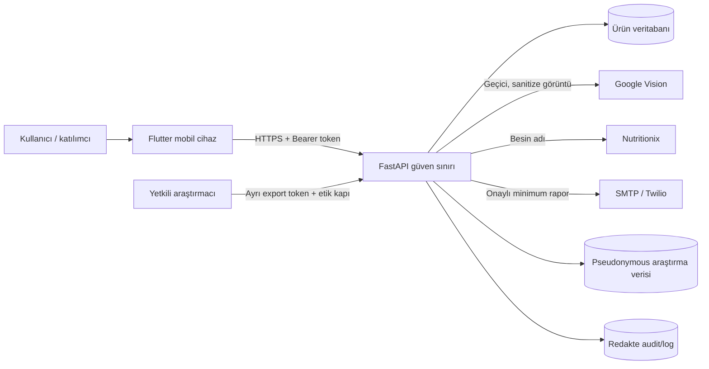

# NutriSense tehdit modeli

Sürüm: 1.0

İnceleme tarihi: 2026-07-26

Kapsam: Flutter mobil uygulama, FastAPI, veritabanı, dış sağlayıcılar ve
araştırma export hattı.

## Varlıklar ve güvenlik hedefleri

| Varlık | Gizlilik | Bütünlük | Erişilebilirlik |
|---|---:|---:|---:|
| Hesap kimliği ve parola hash'i | Yüksek | Yüksek | Orta |
| Access/refresh token | Kritik | Kritik | Orta |
| Beslenme günlüğü ve porsiyon | Yüksek | Kritik | Yüksek |
| Kamera görüntüsü | Yüksek | Yüksek | Orta |
| Diyetisyen iletişimi ve rapor | Yüksek | Kritik | Orta |
| Araştırma onamı/yanıtları | Yüksek | Kritik | Orta |
| Audit olayları | Orta | Kritik | Orta |
| Provider ve signing secret'ları | Kritik | Kritik | Yüksek |
| Model/besin kaynağı provenance | Orta | Kritik | Orta |

Aktörler: hesap sahibi, doğrulanmış diyetisyen, araştırma katılımcısı,
yetkili araştırmacı, backend/DevOps işletmecisi, dış servis sağlayıcısı,
yanlış alıcı, kötü niyetli internet istemcisi, çalınmış cihaz sahibi ve
zararlı/bozuk görüntü gönderen saldırgan.

## Güven sınırları ve veri akışı

Sınırlar:

1. Mobil cihaz güvenilir değildir; token yalnız platform güvenli deposunda
   tutulur ancak root/jailbreak riski tamamen yok olmaz.
2. İnternet ve reverse proxy güvenilmez sınırdır; TLS burada kanıtlanmalıdır.
3. API, sahiplik/rol kontrollerinin zorunlu karar noktasıdır.
4. DB ve yedek işletimi kod deposu dışındaki altyapı sınırıdır.
5. Google Vision, Nutritionix, SMTP ve Twilio ayrı veri alıcısı/işleyici
   sınırlarıdır; sözleşme ve yurtdışı aktarım değerlendirmesi gerekir.
6. Araştırma kimliği ürün hesabından ayrıdır; kod anahtarı oluşturulmaz.

## STRIDE risk kaydı

| ID | STRIDE | Tehdit/senaryo | İlk risk | Kontrol ve kanıt | Artık risk / karar |
|---|---|---|---|---|---|
| TM-01 | S/E | Auth bypass veya sahte JWT | Kritik | İmza, allowlist algoritma, `iss/aud/type/exp/jti`, aktif kullanıcı kontrolü | Anahtar yönetimi ve proxy saat senkronu production kanıtı bekliyor |
| TM-02 | E/I | IDOR ile başka kullanıcının geçmişi/raporu | Kritik | Token subject'inden sahiplik sorgusu; yabancı UUID testleri | Yeni endpointlerde aynı dependency zorunlu; code review kapısı |
| TM-03 | S/I | Refresh token çalınması/replay | Kritik | Secure storage; DB'de hash; rotation, `jti`, revoke/logout; tek kullanımlı zincir | Root cihaz ve yedek davranışı gerçek cihazda test edilmeli |
| TM-04 | I | Secret'ın Git veya imaja sızması | Kritik | Geniş ignore, redakte tree+history scanner, Docker context ignore, CI | Geçmişte olası gerçek secret varsa sağlayıcı rotasyonu zorunlu |
| TM-05 | I/D | Kamera/base64/log sızıntısı | Kritik | Byte/magic/pixel limiti, EXIF temizleme, yeniden kodlama; DB'ye ham görüntü yazmama; log filter | Google aktarımı için kullanıcı metni ve DPA kararı açık |
| TM-06 | I | E-posta/telefon/token/parola loglanması | Yüksek | Merkezi redaksiyon; exception mesajı/traceback bastırma; test | Dış proxy/provider log politikası ayrıca doğrulanmalı |
| TM-07 | T/I | Raporun yanlış alıcıya gönderilmesi | Kritik | Onaylı assignment, doğrulanmış kanal, maskeli önizleme, her gönderimde consent | Kurumsal diyetisyen doğrulama otoritesi belirlenmeli |
| TM-08 | T | Retry/çift tık ile çift mesaj | Yüksek | Kullanıcı+idempotency unique key, outbox kanal durumu, retry limiti | Çok worker concurrency testi production DB'de sürdürülmeli |
| TM-09 | I | SharedPreferences/cache içinde hassas veri | Yüksek | Token `flutter_secure_storage`; cache logout/silmede temizlenir | Android/iOS backup ve cihaz şifreleme kanıtı bekliyor |
| TM-10 | D/E | Malicious/decompression-bomb görüntü | Yüksek | MIME magic, decode, piksel/byte sınırı, resize, timeout, rate limit | Gateway body limiti ve WAF production'da eklenmeli |
| TM-11 | T | SQL injection | Yüksek | SQLAlchemy parametreli ORM, Pydantic şema doğrulama | Raw SQL eklendiğinde inceleme gerekir |
| TM-12 | T/I | Rapor HTML injection | Yüksek | Kullanıcı alanlarında HTML escape; plain-text alternatif | E-posta istemcisi sandbox testi sürdürülmeli |
| TM-13 | D | Brute force / API tüketimi | Yüksek | Login ve analiz limiti, genel body limitleri | In-memory limiter çok instance'a uygun değil; gateway/Redis P1 |
| TM-14 | R/T | Hesap veya araştırma verisinin silinmemesi | Kritik | Hesap silme, research withdrawal, audit, cascade testleri | Backup/provider kopyaları için kurum retention prosedürü P1 |
| TM-15 | I/L | Araştırma export'unun yetkisiz alınması | Kritik | Ayrı export token, etik mod/protokol/onay kapısı, pseudonym | Kurumsal araştırmacı IAM'i henüz yok |
| TM-16 | I | Crash/analytics ile PII aktarımı | Yüksek | Crashlytics kapalı; remote reporter yok | Etkinleştirme yeni DPIA/aydınlatma/onam gerektirir |
| TM-17 | T | Besin sonucu yanlışlığıyla güvenlik zararı | Yüksek | Düşük güvende onay, bilinmeyende sıfır başarı yok, provenance | Tıbbi karar desteği değildir; gerçek model/cihaz doğrulaması bekliyor |
| TM-18 | S/T | Sahte diyetisyen rolü | Kritik | Contact verification ve kullanıcı onaylı assignment modeli | Diyetisyen kimlik doğrulama otoritesi henüz tanımlı değil |

## Güvenlik varsayımları

- Production API yalnız güvenilir reverse proxy üzerinden yayınlanır.
- DB doğrudan internete açık değildir.
- Sağlayıcı secret'ları mobil binary'ye veya GitHub Actions loguna girmez.
- Saatler UTC ve host zaman senkronizasyonu güvenilirdir.
- Gerçek katılımcı toplama yalnız gerçek etik onay alanlarıyla başlar.

Bu varsayımlardan biri sağlanmıyorsa ilgili production kapısı kapanmış sayılır.
Risk sahipleri ve terminler `docs/security_findings_register.md` içindedir.
